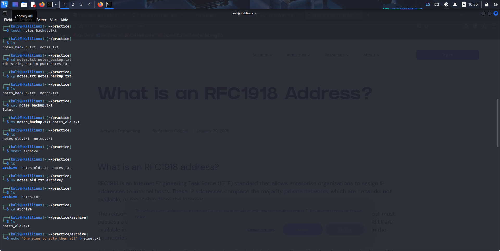
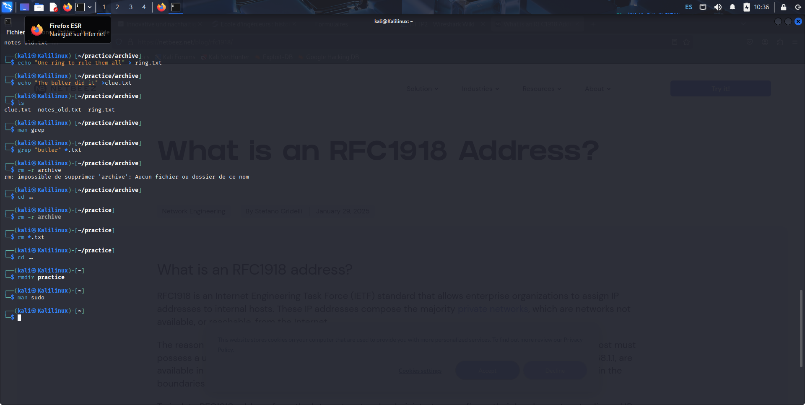
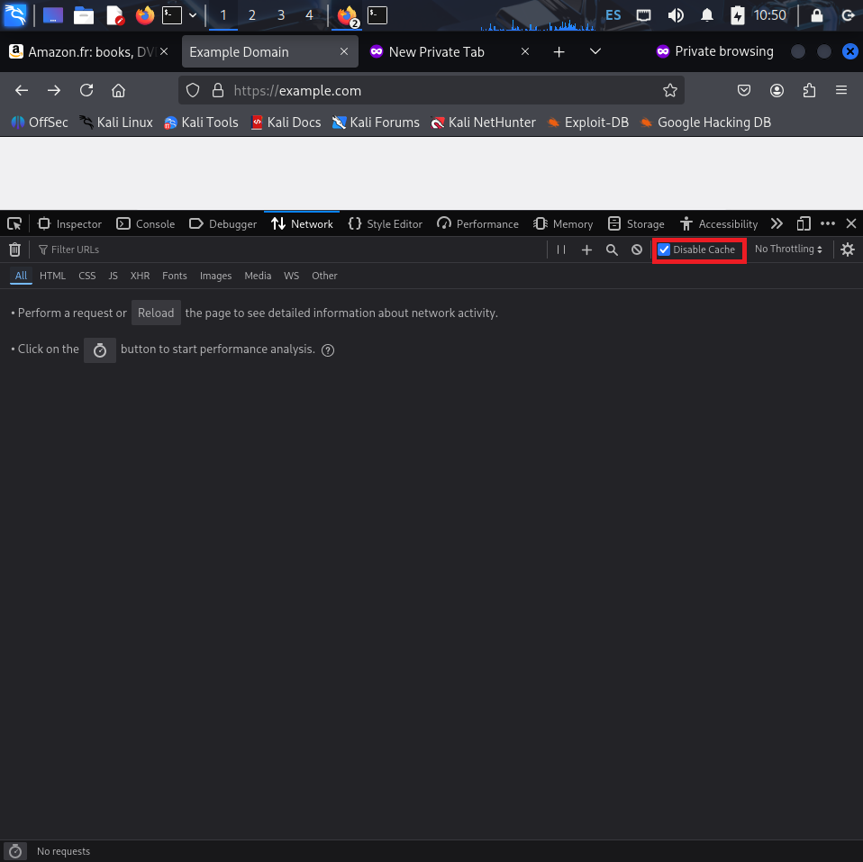
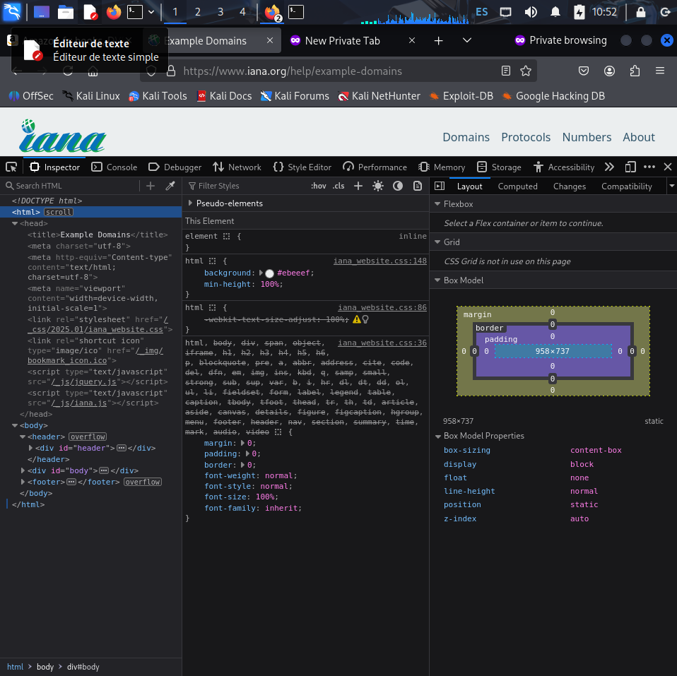
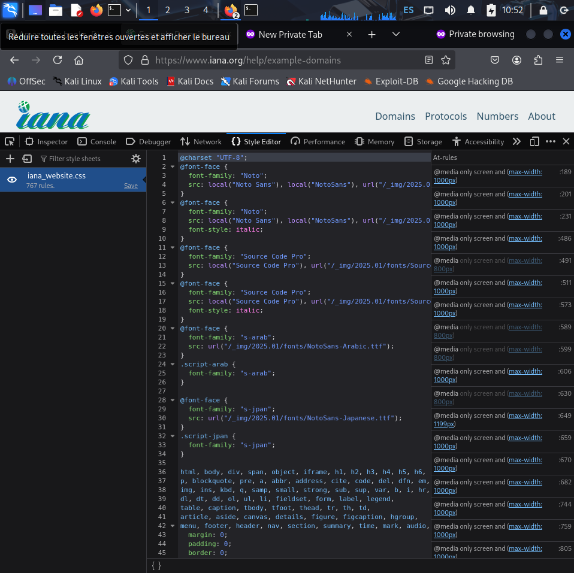
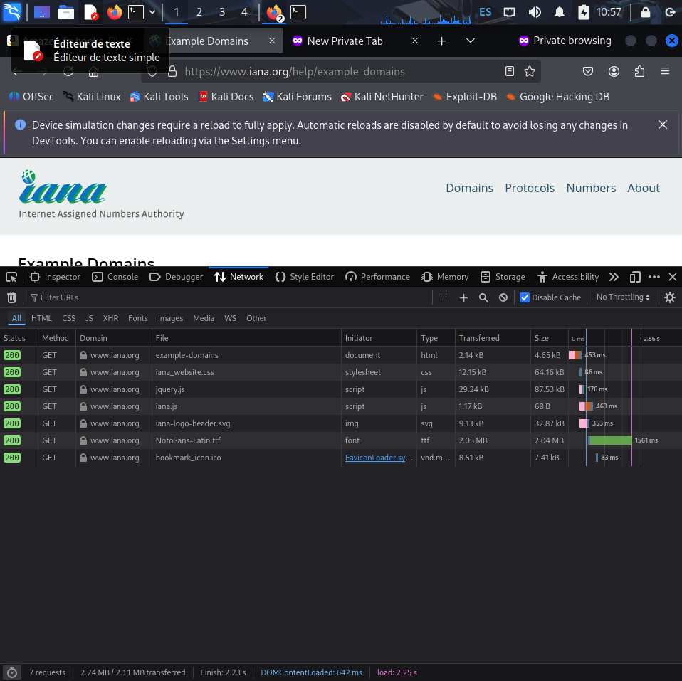

# Lab Terminal – Gestion de fichiers et répertoires

Ce lab a pour objectif de pratiquer les commandes de base dans le terminal Linux.  
Les étapes sont illustrées avec des captures d’écran : `lab1.1`, `lab1.2`, `lab1.3`.

# Lab – Analyse du chargement d’une page web avec les DevTools

Ce lab a pour objectif de comprendre comment un navigateur charge une page web et comment inspecter les requêtes avec les **Outils de développement (DevTools)**.

---

## 1. Préparer l’onglet Réseau

- Ouvrir une fenêtre **Privée/Incognito** pour éviter le cache.
- Aller dans **DevTools** (F12 ou clic droit → Inspecter).
- Onglet **Network (Réseau)**.
- Cliquer sur **Disable cache** pour s’assurer que toutes les requêtes sont visibles.

---

## 2. Chargement du fichier HTML principal

- Le navigateur charge d’abord le document HTML (type = `document`).
- On peut consulter :
  - **Request Headers** → exemple `GET / HTTP/1.1`.
  - **Response Headers** → exemple `HTTP/1.1 200 OK`.
  - **Content** → le code HTML de la page.

---

## 3. Requêtes pour le CSS

- Après le HTML, le navigateur télécharge les fichiers **CSS** mentionnés dans la page.
- Ceux-ci définissent le style et la mise en forme.
- On peut voir le fichier CSS dans la liste des requêtes (type = `stylesheet`).

---

## 4. Exemple de requête GET

- En sélectionnant une ressource (HTML, CSS ou image), on peut observer la requête envoyée au serveur.
- Exemple d’en-tête de requête (Request Headers) :

